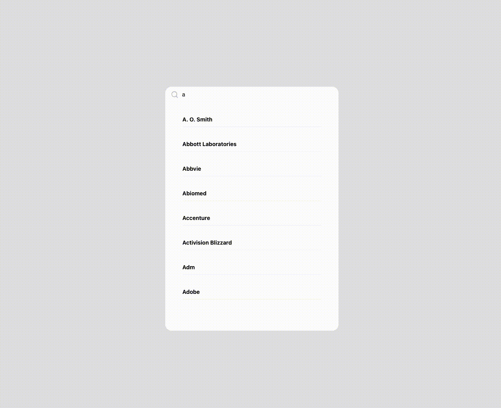

# A Trie - AutoComplete Implemenatation with ReactJS

This project is to show how to implement Trie data structure with JavaScript from scratch.

Automcomplete method produces suggestions. Suggestions are shown in alphabetical order.

Results are displayed in a React app.

## Live

[brif.live](https://brif.live)
